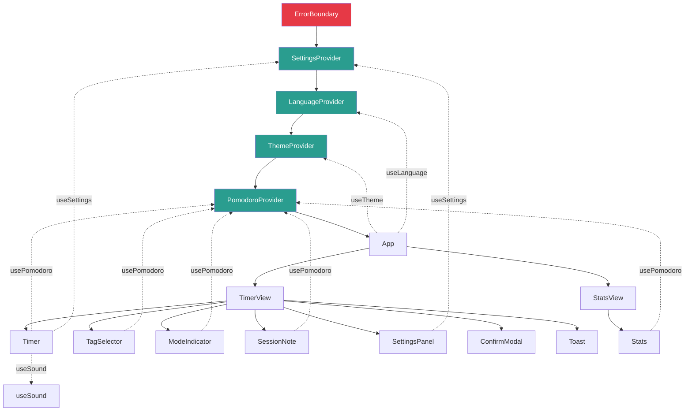
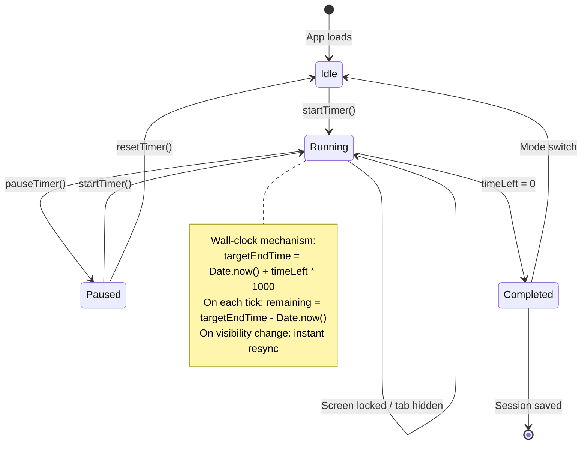
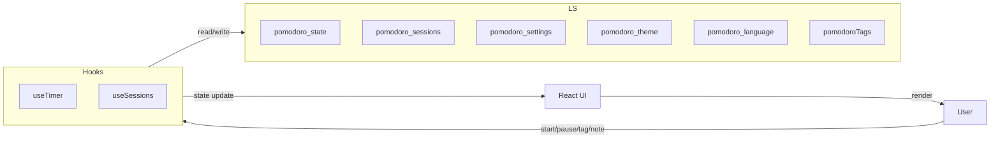

# PomoDoroto

A Pomodoro timer built with React 19 and TypeScript. Features wall-clock countdown (survives screen lock), session tagging, stats tracking, 5-language support, and offline PWA capability.


## Features

**Timer**
- Configurable work/break durations
- Wall-clock countdown — keeps accurate time even when the screen is locked or the tab is backgrounded
- Sound effects on session completion
- Browser notifications
- Finish session early with confirmation

**Organization**
- Tag sessions with custom labels (create, rename, delete)
- Add notes to each session
- Filter stats by tag

**Stats**
- Total sessions and cumulative time
- Per-tag breakdowns
- Full session history with timestamps

**Settings & Personalization**
- Light/dark theme with smooth transitions
- 5 languages: English, Spanish, French, Esperanto, Russian
- Adjustable work/break durations
- Sound toggle
- All preferences persist in localStorage

**PWA**
- Install as standalone app on mobile or desktop
- Offline support via service worker
- Auto-updating

## How It Works

### Component Architecture



### Timer Lifecycle



### Data Flow



## Tech Stack

| Category | Technology | Purpose |
|----------|-----------|---------|
| Framework | React 19 | UI components with hooks |
| Language | TypeScript 5.9 | Static typing |
| Build | Vite 7 + SWC | Fast dev server and builds |
| Styling | CSS Modules + CSS Variables | Scoped styles with theming |
| Icons | lucide-react | Tree-shakeable SVG icons |
| PWA | vite-plugin-pwa + Workbox | Offline support, installability |
| State | React Context | 4 providers (Pomodoro, Settings, Language, Theme) |
| Persistence | localStorage | All data stays on-device |

## Getting Started

**Prerequisites:** Node.js 18+

```bash
# Clone the repository
git clone https://github.com/drt-dave/pomodoro.git
cd pomodoro

# Install dependencies
npm install

# Start dev server
npm run dev

# Build for production
npm run build

# Preview production build
npm run preview
```

The dev server runs at `http://localhost:5173`.

## Project Structure

```
src/
├── components/
│   ├── ConfirmModal.tsx      # Reusable confirmation dialog
│   ├── ErrorBoundary.tsx     # Crash recovery wrapper
│   ├── Logo.tsx              # Inline SVG tomato logo
│   ├── ModeIndicator.tsx     # Work/break mode badge
│   ├── SessionNote.tsx       # Per-session text notes
│   ├── SettingsPanel.tsx     # Duration, sound, clear data
│   ├── Stats.tsx             # Session history and analytics
│   ├── TagSelector.tsx       # Create, rename, delete tags
│   ├── Timer.tsx             # Main countdown display
│   └── Toast.tsx             # Auto-dismiss notifications
├── contexts/
│   ├── LanguageContext.tsx    # i18n with 5 languages
│   ├── SettingsContext.tsx    # Work/break duration, sound
│   └── ThemeContext.tsx       # Light/dark toggle
├── hooks/
│   ├── useSound.ts           # Audio playback hook
│   └── pomodoro/
│       ├── PomodoroContext.tsx # Provider composing all hooks
│       ├── storage.ts         # localStorage read/write helpers
│       ├── types.ts           # PomodoroContextType, PersistedState
│       ├── useSessions.ts     # Session history, tag management
│       └── useTimer.ts        # Wall-clock countdown engine
├── types/
│   └── pomodoro.types.ts     # PomodoroMode, PomodoroSession
├── utils/
│   ├── formatTime.ts         # MM:SS and duration formatting
│   ├── notifications.ts      # Browser notification helpers
│   └── translations.ts       # All strings for 5 languages
├── App.tsx                   # Root layout, navigation, views
├── main.tsx                  # Provider nesting, React mount
└── index.css                 # CSS reset, global variables
```

## Roadmap

- [ ] Add Vitest tests for core timer logic
- [ ] Deploy to Vercel
- [ ] Migrate to Next.js 15 with App Router
- [ ] Add authentication and cloud sync
- [ ] AI-powered productivity insights

## License

MIT
